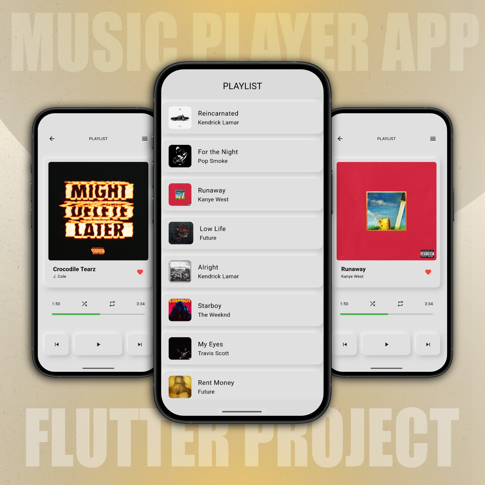
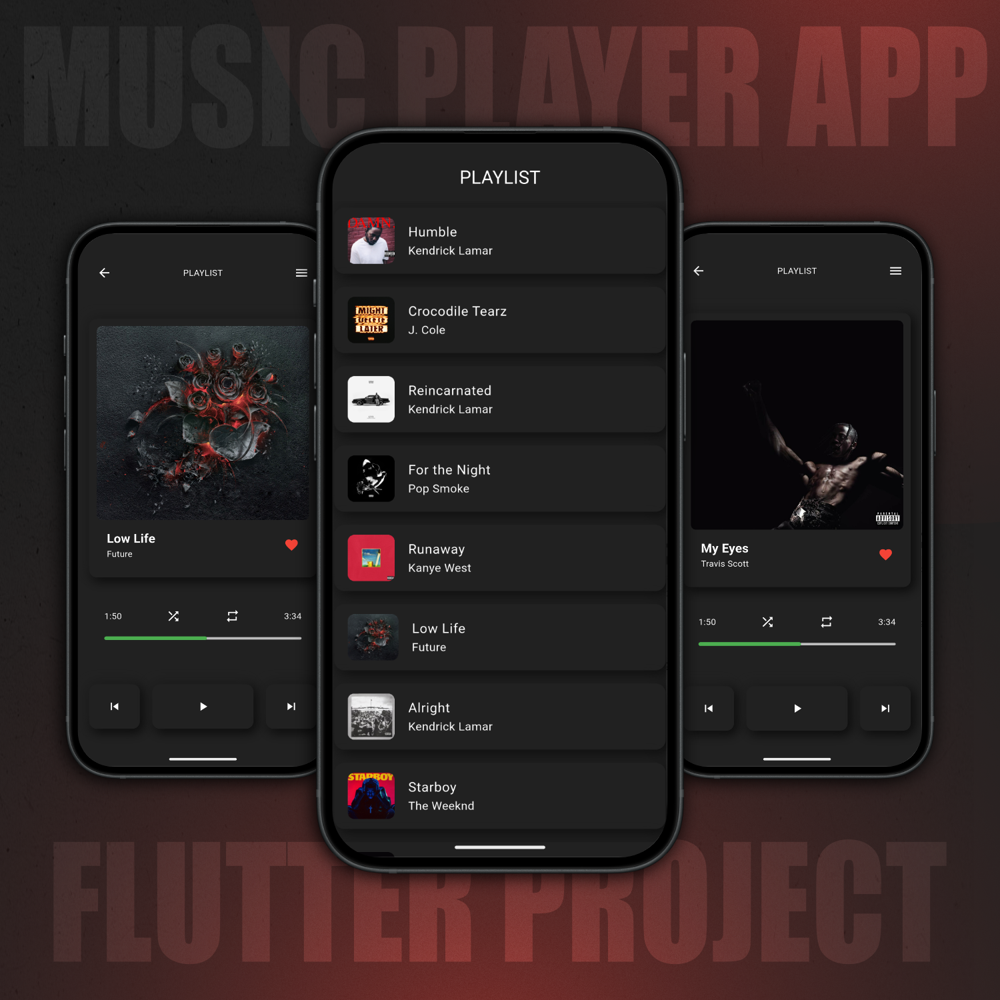
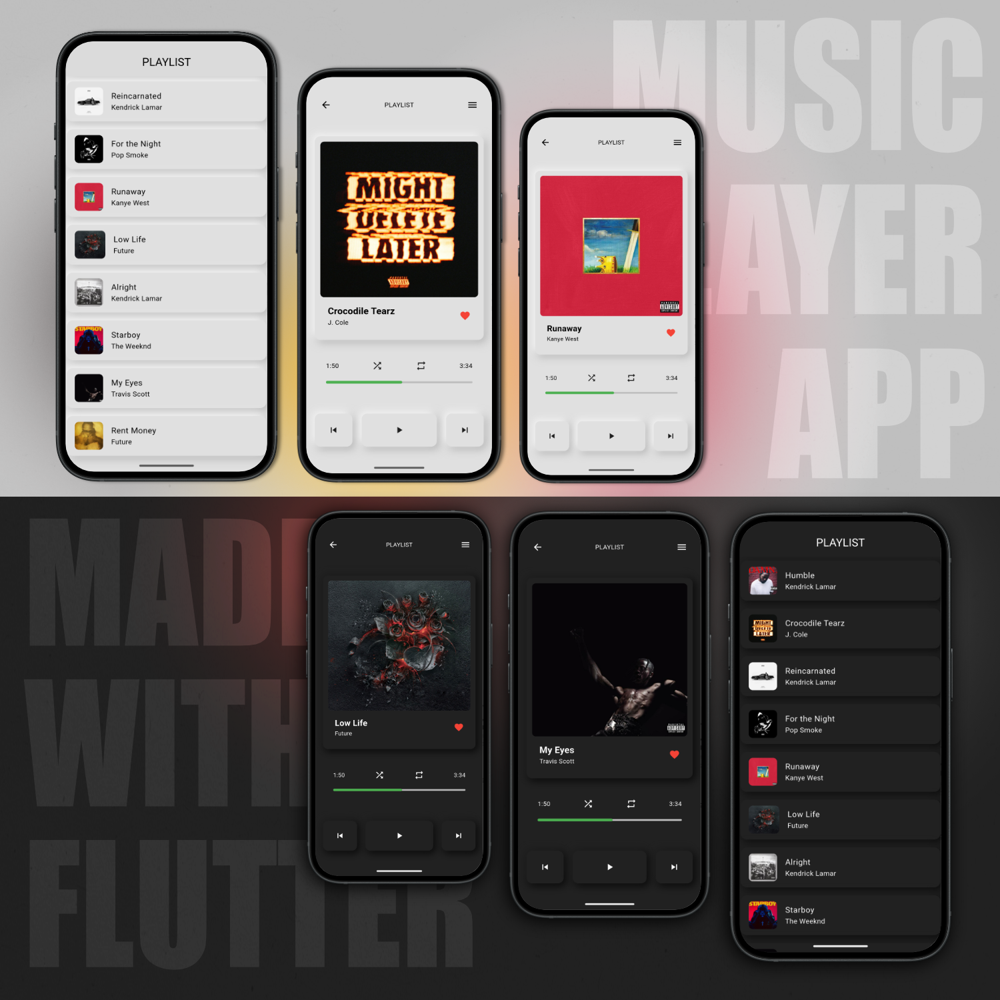

# Minimalist Music Player

A modern music player mobile app made using Flutter, featuring a minimalist, neuromorphic UI.

## 📱 About the app

Features include selecting songs from playlists, and audio playback controls for play, pause, skip next, or skip to previous.
You can also drag the progress bar to seek to a specific point in the song. The app can switch between light and dark mode in the settings page.

## 🚀 Features

- 🎵 Select from a music library
- 🌓 Choose between light and dark mode
- ⏯️ Playback controls

## 💻 Screenshots

|  |  |
| :---------------------------------------------------------------------------: | :---------------------------------------------------------------------------: |
|  |

## Flutter Guide

A few resources to get you started:

- [Lab: Write your first Flutter app](https://docs.flutter.dev/get-started/codelab)
- [Cookbook: Useful Flutter samples](https://docs.flutter.dev/cookbook)

For help getting started with Flutter development, view the
[online documentation](https://docs.flutter.dev/), which offers tutorials,
samples, guidance on mobile development, and a full API reference.
